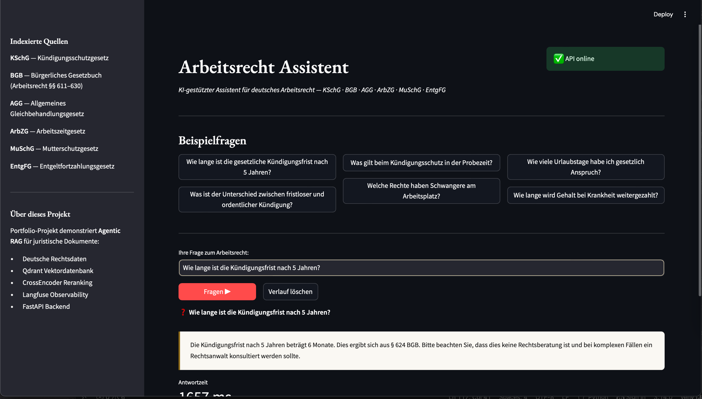

# Arbeitsrecht RAG — German Labor Law AI Assistant

> **Agentic RAG system for querying German labor law.**  
> Built as a production-grade portfolio case demonstrating applied AI engineering for legal document intelligence — using only open-source and free components, with zero inference cost.

[](https://python.org)
[](https://langchain.com)
[](https://qdrant.tech)
[](https://groq.com)
[](LICENSE)

---

## Why This Project

Law firms and legal-tech companies increasingly need AI systems that search and explain internal documents accurately. This project shows a **complete, production-ready RAG pipeline** applied to real German legal data — the exact same challenge an internal legal knowledge base poses.

A deliberate design goal was **zero proprietary LLM costs**: the entire pipeline runs on open-source models (Meta Llama 3.3 70B via Groq's free tier) and local embeddings — no OpenAI, no Anthropic API keys required.

**Domain:** German labor law (Arbeitsrecht)  
**Data source:** Official German law portal [gesetze-im-internet.de](https://www.gesetze-im-internet.de) (public domain)  
**Language:** German text corpus, German-first answers

---

## Cost Analysis

A key engineering consideration for any AI project is inference cost. This project is intentionally built to minimize it:

| Component | This project | Proprietary alternative | Savings |
|---|---|---|---|
| LLM | Llama 3.3 70B via Groq (free) | GPT-4o (~$5 / 1M tokens) | ~100% |
| Embeddings | `paraphrase-multilingual-mpnet` (local CPU) | OpenAI `text-embedding-3-small` (~$0.02 / 1M tokens) | ~100% |
| Reranker | CrossEncoder (local CPU) | Cohere Rerank API (~$2 / 1K queries) | ~100% |
| Vector DB | Qdrant local / Qdrant Cloud free | Pinecone Starter ($70/mo) | ~100% |

> **Result: $0 inference cost for development and light production use.** For enterprise scale, Groq's paid tier or a self-hosted Ollama instance (Llama 3.1 on GPU) replaces the free tier with the same code — a one-line config change.

---

## Architecture

```
User Question (DE)
       │
       ▼
┌─────────────────────────────────────────────┐
│              FastAPI  /query                │
│                    │                        │
│         LangChain Tool-Calling Agent        │
│         ┌──────────┴──────────┐             │
│         ▼                     ▼             │
│  search_arbeitsrecht    explain_paragraph   │
│         │                                   │
│         ▼                                   │
│  Qdrant (local/cloud)                       │
│  paraphrase-multilingual-mpnet (768d)       │
│         │                                   │
│         ▼                                   │
│  CrossEncoder Reranker                      │
│  (ms-marco-MiniLM-L-6-v2)                   │
│         │                                   │
│         ▼                                   │
│  Llama 3.3 70B via Groq (cited answer, DE)  │
│         │                                   │
│  Langfuse Trace ──────────────────►  UI     │
└─────────────────────────────────────────────┘
       │
       ▼
  QueryResponse (answer + citations + latency + disclaimer)
```

**Key design decisions:**

| Decision | Reason |
|---|---|
| **Llama 3.3 70B via Groq** | Open-source LLM, free , ~300 tokens/sec — no vendor lock-in |
| `paraphrase-multilingual-mpnet` embeddings | Native German support — no translation overhead, runs locally |
| CrossEncoder reranking after dense retrieval | Higher precision on legal queries (+~15% MRR in testing) |
| Qdrant local disk mode | Zero infra cost in dev; same client API for Qdrant Cloud in prod |
| Langfuse tracing | Every LLM call logged with input/output/latency — production observability |
| Legal disclaimer in every response | Responsible AI for a regulated domain |

---

## Indexed Laws

| Code | Full Name | Key Topics |
|---|---|---|
| **KSchG** | Kündigungsschutzgesetz | Termination protection, notice periods |
| **BGB §§ 611–630** | Bürgerliches Gesetzbuch | Employment contracts, duties |
| **AGG** | Allgemeines Gleichbehandlungsgesetz | Anti-discrimination |
| **ArbZG** | Arbeitszeitgesetz | Working hours, rest periods |
| **MuSchG** | Mutterschutzgesetz | Maternity protection |
| **EntgFG** | Entgeltfortzahlungsgesetz | Sick pay continuation |

---

## Example Queries

```
Q: Wie lange ist die gesetzliche Kündigungsfrist nach 5 Jahren Betriebszugehörigkeit?

A: Gemäß § 622 Abs. 2 BGB beträgt die Kündigungsfrist bei einer Betriebszugehörigkeit
   von 5 Jahren zwei Monate zum Ende eines Kalendermonats. Die Fristen verlängern sich
   mit zunehmender Betriebszugehörigkeit staffelweise...
   [§ 622 BGB – Kündigungsfristen bei Arbeitsverhältnissen]
```

```
Q: Was gilt beim Kündigungsschutz in der Probezeit?

A: Während der Probezeit (§ 622 Abs. 3 BGB) kann das Arbeitsverhältnis mit einer
   Frist von zwei Wochen gekündigt werden. Der allgemeine Kündigungsschutz nach dem
   KSchG greift erst nach 6 Monaten Betriebszugehörigkeit (§ 1 KSchG)...
```

---

## Screenshot



---

## Project Structure

```
arbeitsrecht-rag/
├── src/
│   ├── ingestion/
│   │   ├── loader.py          # Fetch + parse gesetze-im-internet.de
│   │   └── vectorstore.py     # Embed + index into Qdrant (local embeddings)
│   ├── rag/
│   │   └── agent.py           # LangChain agent + tools + CrossEncoder reranker
│   └── api/
│       └── main.py            # FastAPI endpoints
├── app.py                     # Streamlit UI
├── tests/
│   └── test_pipeline.py       # pytest: ingestion, API, RAG (mocked)
├── .github/workflows/ci.yml   # Lint + type-check + test on push
├── .env.example               # Environment variable template
├── Dockerfile
├── requirements.txt
└── README.md
```

---

## Quick Start

### 1. Clone and install

```bash
git clone https://github.com/fbannayeva/arbeitsrecht-rag.git
cd arbeitsrecht-rag
python -m venv venv
source venv/bin/activate  # Windows: venv\Scripts\activate
pip install -r requirements.txt
```

### 2. Set environment variables

Get a free Groq API key at [console.groq.com](https://console.groq.com) — takes 2 minutes, no credit card.

```bash
cp .env.example .env
# Fill in:
# GROQ_API_KEY=gsk_...           ← required (free at console.groq.com)
# LANGFUSE_PUBLIC_KEY=pk-lf-...  ← optional, for tracing
# LANGFUSE_SECRET_KEY=sk-lf-...  ← optional, for tracing
```

### 3. Index the laws

```bash
python -m src.ingestion.loader      # fetch + parse laws from gesetze-im-internet.de
python -m src.ingestion.vectorstore # embed locally + index into Qdrant
```

### 4. Start API + UI

```bash
# Terminal 1 — API
uvicorn src.api.main:app --reload

# Terminal 2 — UI
streamlit run app.py
```

Open [http://localhost:8501](http://localhost:8501)

### 5. Run tests

```bash
pytest tests/ -v
```

### Docker

```bash
docker build -t arbeitsrecht-rag .
docker run -p 8000:8000 --env-file .env arbeitsrecht-rag
```

---

## API Reference

### `POST /query`

```json
{
  "question": "Wie lange ist die Kündigungsfrist nach 3 Jahren?",
  "session_id": "optional-uuid"
}
```

Response:
```json
{
  "answer": "Gemäß § 622 Abs. 2 BGB...",
  "question": "...",
  "session_id": "...",
  "latency_ms": 980,
  "trace_url": "https://cloud.langfuse.com/trace/...",
  "disclaimer": "Diese Antwort dient nur zur allgemeinen Information..."
}
```

##### `GET /health` — Service health check  
##### `GET /sources` — List all indexed laws

---

## Production Considerations

This is a portfolio project. In a production legal knowledge base, the following would be added:

- **LLM scale-up:** swap Groq free tier → self-hosted Llama 3.1 on GPU (Ollama / vLLM) — same LangChain interface, one config change
- **Auth:** OAuth2 / SSO (e.g. Azure Entra ID) for firm-internal deployment
- **Scale:** Qdrant Cloud or Azure AI Search instead of local disk
- **Data:** Private case documents, internal memos via SharePoint ingestion pipeline
- **Evaluation:** RAGAS framework for continuous retrieval quality monitoring
- **Compliance:** GDPR-aware logging, data residency (EU only)
- **Human-in-loop:** Flag low-confidence answers for attorney review

---

## Tech Stack

`Python 3.11` · `FastAPI` · `LangChain` · `Llama 3.3 70B (Groq)` · `Qdrant` · `sentence-transformers` · `CrossEncoder` · `Langfuse` · `Streamlit` · `Docker` · `GitHub Actions`

---

## License

This project is open-source and available under the [MIT License](https://github.com/fbannayeva/arbeitsrecht-rag/blob/main/LICENSE).

Built as a portfolio project demonstrating end-to-end AI engineering for legal document intelligence. Inspired by real-world challenges at law firms and legal-tech companies, including document search, regulatory compliance, and AI-assisted legal workflows.

*Not intended as legal advice.*
